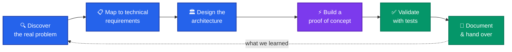
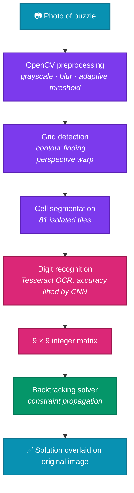
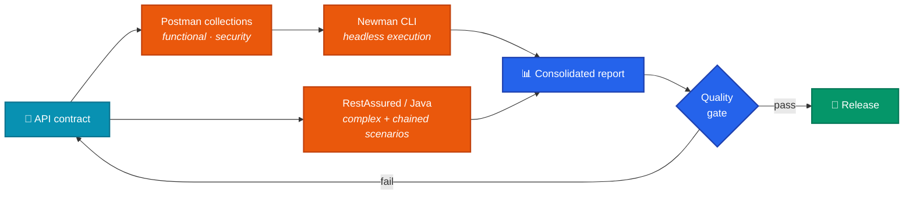

<!-- ─────────────────────────  BANNER  ───────────────────────── -->

  <picture>
    <source media="(prefers-color-scheme: dark)"
            srcset="https://capsule-render.vercel.app/api?type=waving&color=0:0f2027,50:203a43,100:2c5364&height=180&section=header&text=Anastasios%20Kyriazis&fontColor=ffffff&fontSize=42&fontAlignY=32&desc=Solutions%20Engineer%20%C2%B7%20Architect%20in%20the%20making&descAlignY=52&descSize=16&animation=fadeIn"/>
    <source media="(prefers-color-scheme: light)"
            srcset="https://capsule-render.vercel.app/api?type=waving&color=0:2c5364,50:3a7bd5,100:00d2ff&height=180&section=header&text=Anastasios%20Kyriazis&fontColor=ffffff&fontSize=42&fontAlignY=32&desc=Solutions%20Engineer%20%C2%B7%20Architect%20in%20the%20making&descAlignY=52&descSize=16&animation=fadeIn"/>
    
  </picture>

<!-- ─────────────────────────  TYPING ANIMATION  ───────────────────────── -->

  

<!-- ─────────────────────────  CONTACT BAR  ───────────────────────── -->

  
  
  
  

  
  
  
  

---

> [!NOTE]
> **Currently seeking a Solutions Engineer / Pre-Sales Engineer role**, with the goal of growing into Solutions Architecture.
> I'm the engineer who enjoys sitting between the customer and the codebase — scoping the real problem, sketching the
> architecture, building the proof of concept, then making sure someone else can actually run it.
> **Available:** immediately · **Languages:** Greek (native), English (C2) · **Military service:** completed.

## 👋 About me

I'm a software engineer from Thessaloniki finishing a **BSc in Digital Systems at the University of Thessaly**.
My work sits deliberately at the *breadth* end of engineering rather than the depth end — which is exactly the
instinct a solutions role runs on.

Three things shape how I work:

- **🧩 I start from the problem, not the stack.** Every project below began as "what actually needs to happen here?"
  and only then became a technology choice. My Sudoku solver isn't a CNN project — it's a *recognition-under-noise*
  problem that happened to need a CNN.
- **🔌 I think API-first.** Systems earn their value at the seams. I've spent real time in Postman, Newman and
  RestAssured, which means I read contracts before I read implementations.
- **🗣️ I can explain it.** C2-level English and a habit of documenting as I go. An architecture that can't be
  explained to a non-engineer stakeholder isn't finished.

## 🔭 How I approach a solution

## 🛠️ Toolkit

I group what I know by *what it solves*, not by language family — the way it comes up in a scoping call.

| Concern | Tools I work with |
|---|---|
| **Backend & core logic** |    |
| **Frontend & demos** |      |
| **APIs & integration** |    |
| **Data & AI** |    |
| **Platforms & practice** |    |

  

---

## 🚀 Featured work

Each project below is a full problem → architecture → validation loop. Expand any one for the design reasoning.

<b>🧠 AI Sudoku Solver</b> — computer vision under real-world noise &nbsp;·&nbsp; <code>Python · OpenCV · CNN · Tesseract</code>

 

**The problem:** reading a puzzle from a *photograph* — skewed angle, uneven lighting, printed digits that OCR alone
gets wrong often enough to poison the solve.

**The design decision:** OCR was the weak link, so I didn't replace the pipeline — I reinforced exactly that stage
with a CNN and left the cheap deterministic stages alone.

**What it demonstrates:** identifying the true bottleneck in a pipeline and spending complexity only where it pays.

<a href="https://github.com/Ankyriazis/ai_sudoku_solver">→ View repository</a>

<b>🔌 API Testing Framework</b> — contract validation built for CI &nbsp;·&nbsp; <code>Postman · Newman CLI · RestAssured (Java)</code>

 

**The problem:** manual API checks don't survive contact with a release cadence. Coverage needs to be executable,
repeatable and runnable by someone who didn't write it.

**The design decision:** two layers on purpose — Postman/Newman for fast, readable, *shareable* collections that a
non-author can run, and RestAssured for the advanced scenarios that need real Java logic.

**What it demonstrates:** the pre-sales / solutions habit of making technical proof *transportable* — a collection
someone else can execute is worth more than a test only I can run.

<a href="https://github.com/Ankyriazis/API-Testing-Framework">→ View repository</a>

<b>📊 Algorithm Visualization Tool</b> — making the invisible explainable &nbsp;·&nbsp; <code>Java · JavaFX · Swing</code>

 

**The problem:** sorting and pathfinding algorithms are hard to *teach* because their execution is invisible.

**The design decision:** step-granular playback rather than an animation you can only watch. Control belongs to the
person trying to understand it — which is the same principle behind a good technical demo.

**What it demonstrates:** communication as an engineering deliverable. This is the project closest to what a
solutions engineer does daily: turn an opaque system into something a room full of people can follow.

<a href="https://github.com/Ankyriazis/algorithm-visualization-tool">→ View repository</a>

### At a glance

| Project | The problem it solves | Stack |
|---|---|---|
| **[🧠 AI Sudoku Solver](https://github.com/Ankyriazis/ai_sudoku_solver)** | Reading a puzzle from a real photograph, where OCR alone is too unreliable to trust |    |
| **[🔌 API Testing Framework](https://github.com/Ankyriazis/API-Testing-Framework)** | Making API coverage repeatable, CI-runnable and executable by someone who didn't write it |   |
| **[📊 Algorithm Visualization Tool](https://github.com/Ankyriazis/algorithm-visualization-tool)** | Making algorithm execution visible so it can actually be taught and understood |   |

---

## 🧭 Road to Solutions Architect

Honest status board — what's behind me, what I'm walking toward.

- [x] Software engineering fundamentals — OOP, SOLID, design patterns
- [x] Data structures, algorithms & complexity analysis
- [x] API design, contract testing & automation (Postman · Newman · RestAssured)
- [x] Full-stack delivery, front to back
- [x] English at C2 — stakeholder-ready communication
- [ ] **Cloud foundations** — AWS Solutions Architect Associate *(in progress)*
- [ ] **Containers & orchestration** — Docker → Kubernetes
- [ ] **Distributed system design** — messaging, caching, resilience patterns
- [ ] **Infrastructure as Code** — Terraform

> [!TIP]
> Recruiting for a solutions or pre-sales team? The fastest read on how I think is the
> **[API Testing Framework](https://github.com/Ankyriazis/API-Testing-Framework)** — it's the project where the
> engineering and the *communicating* meet.

---

## 🎓 Credentials

| | |
|---|---|
| **Education** | BSc, Department of Digital Systems — **University of Thessaly**, Larisa *(2019 – present)* |
| **Focus areas** | Object-oriented design & SOLID · Data structures & algorithms · Statistical analysis & probability · Agile, version control, automated testing, CI/CD |
| **English** | **C2 — ECPE**, Michigan Language Assessment / Cambridge *(2020)* |
| **Greek** | Native |
| **Military service** | Completed — no pending obligation |
| **Mobility** | Full car & A2 motorbike licence · open to relocation and remote work |

<!--
  OPTIONAL — animated contribution snake.
  Left disabled deliberately: it renders your contribution grid, and a sparse grid
  reads worse to a recruiter than no grid at all. Once you have a few months of
  steady commits, run .github/workflows/snake.yml once and uncomment this block.

  <picture>
    <source media="(prefers-color-scheme: dark)" srcset="https://raw.githubusercontent.com/Ankyriazis/Ankyriazis/output/snake-dark.svg"/>
    <source media="(prefers-color-scheme: light)" srcset="https://raw.githubusercontent.com/Ankyriazis/Ankyriazis/output/snake.svg"/>
    
  </picture>

-->

---

## 🤝 Let's talk

If you're building something and you're not yet sure what it should look like — that's the conversation I want.

  
  
  

  <picture>
    <source media="(prefers-color-scheme: dark)" srcset="https://capsule-render.vercel.app/api?type=waving&color=0:2c5364,50:203a43,100:0f2027&height=110&section=footer"/>
    <source media="(prefers-color-scheme: light)" srcset="https://capsule-render.vercel.app/api?type=waving&color=0:00d2ff,50:3a7bd5,100:2c5364&height=110&section=footer"/>
    
  </picture>

