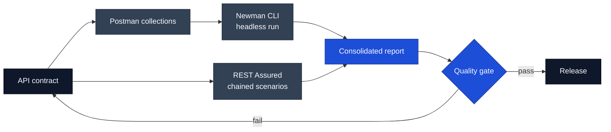

# Anastasios Kyriazis

Solutions engineer based in Thessaloniki, Greece. I work at the boundary between what a customer
needs and what a system should do: scoping the problem, designing the shape of the answer, and
building the proof of concept that removes the risk from it.

[Curriculum vitae](assets/cv.pdf) &nbsp;·&nbsp;
[LinkedIn](https://linkedin.com/in/anastasios-kyriazis) &nbsp;·&nbsp;
[Stack Overflow](https://stackoverflow.com/users/22003274/akyriii) &nbsp;·&nbsp;
[akiriazis2@gmail.com](mailto:akiriazis2@gmail.com)

---

## Background

|  |  |
|---|---|
| **Education** | BSc, Department of Digital Systems — University of Thessaly, Larisa |
| **Coursework** | Object-oriented design, data structures and algorithms, statistical analysis and probability, software engineering practice |
| **Languages** | Greek (native) · English (C2, ECPE — Michigan Language Assessment / Cambridge, 2020) |
| **Availability** | Open to relocation and to remote work · military service completed |

## Technical scope

| Area | |
|---|---|
| **Languages** | Java · Python · C++ · JavaScript · SQL |
| **Web and mobile** | React · HTML · CSS · Flutter |
| **APIs and testing** | Postman · Newman CLI · REST Assured |
| **Data and vision** | OpenCV · NumPy |
| **Platforms and practice** | Linux/Unix · Git · Agile · CI/CD |

---

## Selected work

### Sudoku recognition pipeline

Reading a puzzle from a photograph rather than a clean scan. The difficulty is not the solve —
backtracking handles that in milliseconds — but everything upstream of it: perspective distortion,
uneven lighting, and character recognition that has to be right 81 times in a row for the solve to
mean anything.

The pipeline keeps each stage cheap and deterministic, so that when recognition fails it is obvious
*where* it failed.

Python · OpenCV · NumPy · Tesseract — [repository](https://github.com/Ankyriazis/ai_sudoku_solver)

### API contract testing framework

Manual API checks do not survive a release cadence. The design goal was coverage that is executable,
repeatable, and runnable by someone who did not write it — which is the difference between a test
that proves something to me and a test that proves something to a customer.

Two layers, deliberately: Postman collections that are readable and shareable, and REST Assured for
the chained scenarios that need real program logic.

Postman · Newman · REST Assured · Java — [repository](https://github.com/Ankyriazis/API-Testing-Framework)

### Algorithm visualiser

Sorting and pathfinding algorithms are difficult to teach because their execution is invisible. The
tool gives step-granular playback rather than an animation you can only watch — control belongs to
the person trying to understand it, which is the same principle that separates a useful technical
demo from a performance.

Java · JavaFX · Swing — [repository](https://github.com/Ankyriazis/algorithm-visualization-tool)

---

## Currently

Working toward the AWS Solutions Architect Associate certification, and building depth in
containerisation and distributed system design — the areas that separate designing a component from
designing a system.

## Contact

The fastest way to reach me is [email](mailto:akiriazis2@gmail.com) or
[LinkedIn](https://linkedin.com/in/anastasios-kyriazis). My
[curriculum vitae](assets/cv.pdf) is in this repository.
