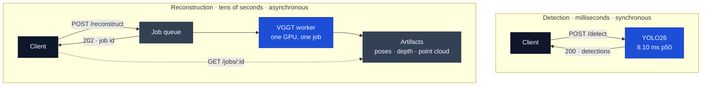

# Anastasios Kyriazis

Solutions engineer based in Thessaloniki, Greece. I work at the boundary between what a customer
needs and what a system should do: scoping the problem, designing the shape of the answer, and
building the proof of concept that removes the risk from it.

[Curriculum vitae](assets/cv.pdf) &nbsp;·&nbsp;
[LinkedIn](https://linkedin.com/in/anastasios-kyriazis) &nbsp;·&nbsp;
[Stack Overflow](https://stackoverflow.com/users/22003274/akyriii) &nbsp;·&nbsp;
[akiriazis2@gmail.com](mailto:akiriazis2@gmail.com)

---

## Background

|  |  |
|---|---|
| **Education** | BSc, Department of Digital Systems — University of Thessaly, Larisa |
| **Coursework** | Object-oriented design, data structures and algorithms, statistical analysis and probability, software engineering practice |
| **Languages** | Greek (native) · English (C2, ECPE — Michigan Language Assessment / Cambridge, 2020) |
| **Availability** | Open to relocation and to remote work · military service completed |

## Technical scope

| Area | |
|---|---|
| **Languages** | Java · Python · C++ · JavaScript · SQL |
| **Services and APIs** | FastAPI · REST · Postman · Newman CLI · REST Assured |
| **Deployment** | Docker · Docker Compose · CUDA · ONNX Runtime |
| **Vision and ML** | OpenCV 5 · PyTorch · YOLO26 · NumPy |
| **Web and mobile** | React · HTML · CSS · Flutter |
| **Platforms and practice** | Linux/Unix · Git · Agile · CI/CD |

---

## Selected work

Two vision services built on the same hardware, deliberately shaped differently. Putting them
side by side is the clearest thing I can show about how I design: the workload dictates the
contract, and getting that wrong is not something a better implementation recovers from.

### Object detection service — synchronous

YOLO26 behind a FastAPI endpoint, with OpenCV 5 for decode and annotation. Measured **8.10 ms
at p50** and 99 images/second on an RTX 4060, which comfortably fits a request/response shape.

The interesting work is around the model rather than in it: weights loaded once at startup with
warmup inferences, so the first caller does not absorb CUDA initialisation; uploads decoded in
memory rather than through a temp file; an ONNX export path that verifies its own output by
loading the graph back and running it, because Ultralytics reports success as soon as a file
exists. 22 tests, none needing a GPU.

Python · FastAPI · YOLO26 · OpenCV 5 · ONNX · Docker —
[repository](https://github.com/Ankyriazis/yolo26-inference-service)

### 3D reconstruction from unposed images — asynchronous

VGGT recovers camera poses, depth and a point cloud from several photographs with no calibration
step. A reconstruction takes tens of seconds, so the synchronous shape is simply unavailable: the
API accepts work with `202` and a job id, and the client polls.

The measurement that mattered was memory, not latency. On an 8 GB card the working set for two
views is 6.95 GB while the desktop leaves 6.94 GB free — **over budget by ten megabytes**. CUDA
does not fail there; it pages to host memory and continues, so the same job ran in 1.35 s when it
fitted and 71 s when it did not, with nothing logged in between. The service now records its VRAM
budget at startup and reports the shortfall on `/readyz`, which turns a fiftyfold mystery into a
line an operator can act on.

Python · FastAPI · VGGT · PyTorch · CUDA · Docker —
[repository](https://github.com/Ankyriazis/vggt-reconstruction-service)

Both also forced a licensing decision rather than a default one: the detector is AGPL-3.0 because
Ultralytics is, and the reconstruction service is MIT over weights that are CC BY-NC, which it
depends on rather than redistributes. Knowing which checkpoint you are allowed to ship is part of
the design, not paperwork after it.

### Earlier work

**[Sudoku recognition pipeline](https://github.com/Ankyriazis/ai_sudoku_solver)** — reading a
puzzle from a photograph, where the solve is trivial and everything upstream is not: perspective
correction, cell segmentation, and character recognition that has to be right 81 times in a row.
Reads the sample image with zero errors across 81 cells. *Python · OpenCV · Tesseract*

**[API contract testing framework](https://github.com/Ankyriazis/API-Testing-Framework)** —
coverage that is executable, repeatable and runnable by someone who did not write it, which is the
difference between proving something to myself and proving it to a customer. *Postman · Newman ·
REST Assured*

**[Algorithm visualiser](https://github.com/Ankyriazis/algorithm-visualization-tool)** —
step-granular playback rather than an animation you can only watch, because control belongs to the
person trying to understand it. *Java · JavaFX*

---

## Currently

Working toward the AWS Solutions Architect Associate certification. The two services above are
where I have been building the rest of it: containerisation, GPU deployment, and the habit of
measuring a system on the hardware it will actually run on rather than trusting the number that
flattered it first.

## Contact

The fastest way to reach me is [email](mailto:akiriazis2@gmail.com) or
[LinkedIn](https://linkedin.com/in/anastasios-kyriazis). My
[curriculum vitae](assets/cv.pdf) is in this repository.
